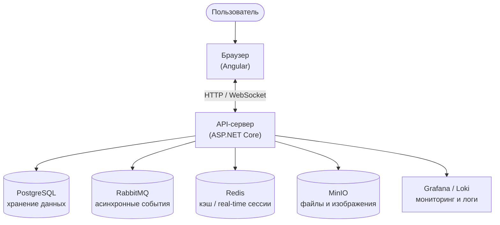

# Hackathon Platform

Платформа для организации и проведения хакатонов: создание мероприятий, управление командами, общение участников и публикация результатов.

## Архитектура системы

## Роли пользователей

| Роль | Возможности |
|------|-------------|
| **Пользователь** | Создаёт события и команды, участвует в мероприятиях, общается в чатах, добавляет друзей |
| **Администратор** | Все права пользователя + модерация событий, просмотр журнала действий, управление пользователями |

## Основные понятия

- **Событие** — хакатон или соревнование. Имеет жизненный цикл от черновика до завершения. Подробнее: [events.md](events.md)
- **Команда** — группа участников, работающая в рамках события. Бывает открытой или закрытой. Подробнее: [teams.md](teams.md)
- **Проект** — результат работы команды в событии: описание, файлы, ссылка на ветку Git-репозитория

## Разделы документации

| Файл | Содержание |
|------|------------|
| [events.md](events.md) | Создание и управление событиями, жизненный цикл |
| [teams.md](teams.md) | Команды, вступление, проект команды |
| [communication.md](communication.md) | Чаты, уведомления, дружба |
| [moderation.md](moderation.md) | Модерация событий, журнал действий |
| [architecture/modularization.md](architecture/modularization.md) | Кандидаты на выделение в модули и их готовность |
| [architecture/auth-module-extraction-plan.md](architecture/auth-module-extraction-plan.md) | План выделения модуля Auth |
| [architecture/email-confirmation-to-informing-plan.md](architecture/email-confirmation-to-informing-plan.md) | План переноса подтверждения Email в модуль Informing |
